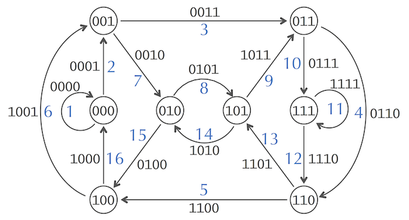

# LIVRE avec les différentes questions

# Lesson 3.1 : Exploding Newspapers

Imagine that we stack a hundred copies of the June 27, 2000 edition of the New York Times on a pile of dynamite, and then we light the fuse. We ask you to further suspend your disbelief and assume that the newspapers are not all incinerated but instead explode cartoonishly into smoldering pieces of confetti. How could we use the tiny snippets of newspaper to figure out what the news was on June 27, 2000? We will call this crazy conundrum the Newspaper Problem.

Figure: Don’t try this at home! Crazy as it may seem, the Newspaper Problem serves as an analogy for the computational framework of genome assembly.

The Newspaper Problem is even more difficult than it may seem. Because we had multiple copies of the same edition of the newspaper, and because we undoubtedly lost some information in the blast, we cannot simply glue together one of the newspaper copies in the same way that we would assemble a jigsaw puzzle. Instead, we need to use overlapping fragments from different copies of the newspaper to reconstruct the day’s news, as shown in the figure below.

Figure: In the Newspaper Problem, we need to use overlapping shreds of paper to figure out the news.

Fine, you ask, but what do exploding newspapers have to do with biology? Determining the order of nucleotides in a genome, or genome sequencing, presents a fundamental task in bioinformatics. Genomes vary in length; your own genome is roughly 3 billion nucleotides long, whereas the genome of Amoeba dubia, an amorphous unicellular organism, is approximately 200 times longer! This unicellular organism competes with the rare Japanese flower Paris japonica for the title of species with the longest genome.

The first sequenced genome, belonging to a φX174 bacterial phage (i.e., a virus that preys on bacteria), had only 5,386 nucleotides and was completed in 1977 by Frederick Sanger. Four decades after this Nobel Prize-winning discovery, genome sequencing has raced to the forefront of bioinformatics research, as the cost of sequencing plummeted. Because of the decreasing cost of sequencing, we now have thousands of sequenced genomes, including those of many mammals (see below).

Figure: The first mammals with sequenced genomes.
To sequence a genome, we must clear some practical hurdles. The largest obstacle is the fact that biologists still lack the technology to read the nucleotides of a genome from beginning to end in the same way that you would read a book. The best they can do is sequence much shorter DNA fragments called reads. The reasons why researchers can sequence small pieces of DNA but not long genomes warrant their own discussion. For more details, see "DETOUR: A Short History of DNA Sequencing Technologies" in the print companion or at Cogniterra.

In this chapter, however, our aim is to turn an apparent handicap into a useful tool for putting the genome back together.

The traditional method for sequencing genomes is described as follows. Researchers take a small tissue or blood sample containing millions of cells with identical DNA, use biochemical methods to break the DNA into fragments, and then sequence these fragments to produce reads (see figure below).

The difficulty is that researchers do not know where in the genome these reads came from, and so they must use overlapping reads to reconstruct the genome. Thus, putting a genome back together from its reads, or genome assembly, is just like the Newspaper Problem.

Figure: In DNA sequencing, many identical copies of a genome are broken in random locations to generate short reads, which are then sequenced and assembled into the nucleotide sequence of the genome.

Even though researchers have sequenced many genomes, a giant genome like that of Amoeba dubia still remains beyond the reach of modern sequencing technologies. You might guess that the barrier to sequencing such a genome would be experimental, but that is not true; biologists can easily generate enough reads to analyze a large genome, but assembling these reads still presents a major computational challenge.

# Lesson 3.2 : The String Reconstruction Problem

## Genome assembly is more difficult than you think
Before we introduce a computational problem modeling genome assembly, we will take a moment to discuss a few practical complications that make genome assembly more difficult than the Newspaper Problem.

First, DNA is **double-stranded**, and we have no way of knowing a priori which strand a given read derives from, meaning that we will not know whether to use a read or its reverse complement when assembling a particular strand of a genome. Second, **modern sequencing machines are not perfect**, and the reads that they generate often contain errors. Sequencing errors complicate genome assembly because they prevent us from identifying all overlapping reads. Third, **some regions of the genome may not be covered by any reads**, making it impossible to reconstruct the entire genome.

Since the reads generated by modern sequencers often have the same length, we may safely assume that reads are all k-mers for some value of k. The first part of this chapter will assume an ideal — and unrealistic — situation in which all reads come from the same strand, have no errors, and exhibit perfect coverage, so that every k-mer substring of the genome is generated as a read. Later, we will show how to relax these assumptions for more realistic datasets.

## Reconstructing strings from k-mers

We are now ready to define a computational problem modeling genome assembly. Given a string Text, its k-mer composition Compositionk(Text) is the collection of all k-mer substrings of Text (including repeated k-mers). For example,

Composition3(TATGGGGTGC) = {ATG, GGG, GGG, GGT, GTG, TAT, TGC, TGG}.

Note that we have listed k-mers in lexicographic order (i.e., how they would appear in a dictionary) rather than in the order of their appearance in TATGGGGTGC. We have done this because the correct ordering of the reads is unknown when they are generated.

String Composition Problem: Generate the k-mer composition of a string.

Input: An integer k and a string Text.
Output: Compositionk(Text), where the k-mers are arranged in lexicographic order.

**Code Challenge: Solve the String Composition Problem. (Solve at Cogniterra or Rosalind.)
https://rosalind.info/problems/ba3a/
**

Input: An integer k and a string Text.
Output: Compositionk(Text).
Solving the String Composition Problem is a straightforward exercise, but in order to model genome assembly, we need to solve its inverse problem.

String Reconstruction Problem: Reconstruct a string from its k-mer composition.

Input: An integer k and a collection Patterns of k-mers.
Output: A string Text with k-mer composition equal to Patterns (if such a string exists).
Before we ask you to solve the String Reconstruction Problem, let’s consider the following example of a 3-mer composition:

AAT   ATG   GTT   TAA   TGT

The most natural way to solve the String Reconstruction Problem is to mimic the solution of the Newspaper Problem and "connect" a pair of k-mers if they overlap in k-1 symbols. For the above example, it is easy to see that the string should start with TAA because there is no 3-mer ending in TA. This implies that the next 3-mer in the string should start with AA. There is only one 3-mer satisfying this condition, AAT:

TAA   AAT

In turn, AAT can only be extended by ATG, which can only be extended by TGT, and so on, leading us to reconstruct TAATGTT:

TAA    
 AAT   
  ATG  
   TGT 
    GTT
TAATGTT

It looks like we are finished with the String Reconstruction Problem and can let you move on to the next chapter. To be sure, let’s consider an additional 3-mer composition:

AAT  ATG  ATG  ATG  CAT  CCA  GAT  GCC  GGA  GGG  GTT  TAA  TGC  TGG  TGT

STOP and Think: Reconstruct a string with this composition.

If we start again with TAA, then the next 3-mer in the string should start with AA, and there is only one such 3-mer, AAT. In turn, AAT can only be extended by ATG.

TAA  
 AAT 
  ATG
TAATG

ATG can be extended either by TGC, or TGG, or TGT. Now we must decide which of these 3-mers to choose. Let’s select TGT:

TAA   
 AAT  
  ATG 
   TGT
TAATGT

After TGT, our only choice is GTT:

TAA   
 AAT  
  ATG 
   TGT
    GTT
TAATGTT

Unfortunately, now we are stuck at GTT because no 3-mers in the composition start with TT! We could try to extend TAA to the left, but no 3-mers in the composition end with TA.

You may have found this trap on your own and already discovered how to escape it. Like a good chess player, if you think a few steps ahead, then you would never extend ATG by TGT until reaching the end of the genome. With this thought in mind, let’s take a step back, extending ATG by TGC instead:

TAA   
 AAT  
  ATG 
   TGC
TAATGC

Continuing the process, we obtain the following assembly:

TAA             
 AAT            
  ATG           
   TGC          
    GCC         
     CCA        
      CAT       
       ATG      
        TGG     
         GGA    
          GAT   
           ATG  
            TGT 
             GTT
TAATGCCATGGATGTT

Yet this assembly is incorrect because we have only used fourteen of the fifteen 3-mers in the composition (we omitted GGG), making our reconstructed genome one nucleotide too short.

**Repeats complicate genome assembly**
The difficulty in assembling this simulated genome arises because ATG is repeated three times in the 3-mer composition, which causes us to have the three choices TGG, TGC, and TGT by which to extend ATG. Repeated substrings in the genome are not a serious problem when we have just 15 reads, but with millions of reads, repeats make it much more difficult to "look ahead" and construct the correct assembly.

If you followed our discussion of finding the origin of replication in bacterial genomes, you know how unlikely it is to witness a long repeat in a randomly generated sequence of nucleotides. You also know that real genomes are anything but random. Indeed, approximately 50% of the human genome is made up of repeats, e.g., the approximately 300 nucleotide-long Alu sequence is repeated over a million times, with only a few nucleotides inserted/deleted/substituted each time. For more details, see "DETOUR: Repeats in the Human Genome" in the print companion or at Cogniterra.

An analogy illustrating the difficulty of assembling a genome with many repeats is the Triazzle® jigsaw puzzle (shown below). People usually put together jigsaw puzzles by connecting matching pieces. However, every piece in the Triazzle matches more than one other piece; in the Triazzle below, each frog appears several times. If you proceed carelessly, then you will likely match most of the pieces but fail to fit the remaining ones. And yet the Triazzle has only sixteen pieces, which should give us pause about assembling a genome from millions of reads.

STOP and Think: Design a strategy for assembling the Triazzle puzzle.

Figure: Each Triazzle has only sixteen pieces but carries a warning: "It's Harder than it Looks!"

# Lesson 3.3 String Reconstruction as a Walk in the Overlap Graph

## From a string to a graph
Repeats in a genome necessitate some way of looking ahead to see the correct assembly in advance. Returning to our above example, you may have already found that TAATGCCATGGGATGTT is a solution to the String Reconstruction Problem for the collection of fifteen 3-mers in the last section, as illustrated below. Note that we use a different color for each interval of the string between occurrences of ATG.

STOP and Think: Is this the only solution to the String Reconstruction Problem for this collection of 3-mers?

In the figure below, consecutive 3-mers in TAATGCCATGGGATGTT are linked together to form this string's genome path.

Figure: The fifteen color-coded 3-mers making up TAATGCCATGGGATGTT are joined into the genome path according to their order in the genome.

String Spelled by a Genome Path Problem. Reconstruct a string from its genome path.

Input: A sequence path of k-mers Pattern1, … ,Patternn such that the last k - 1 symbols of Patterni are equal to the first k-1 symbols of Patterni+1 for 1 ≤ i ≤ n-1.
Output: A string Text of length k+n-1 such that the i-th k-mer in Text is equal to Patterni (for 1 ≤ i ≤ n).
Reconstructing the genome from its genome path is easy: as we proceed from left to right, the 3-mers “spell’ out TAATGCCATGGGATGTT, adding one new symbol to the genome at each new 3-mer.  This yields a function PathToGenome(path).

Unfortunately, constructing the genome path requires us to know the genome in advance.

Code Challenge: Solve the String Spelled by a Genome Path Problem. (Solve on Cogniterra or Rosalind.)

STOP and Think: Could you construct the genome path if you knew only the genome’s 3-mer composition?

In this chapter, we will use the terms prefix and suffix to refer to the first k − 1 nucleotides and last k − 1 nucleotides of a k-mer, respectively. For example, Prefix(TAA) = TA and Suffix(TAA) = AA. We note that the suffix of a 3-mer in the genome path is equal to the prefix of the following 3-mer in the path. For example, Suffix(TAA) = Prefix(AAT) = AA in the genome path for TAATGCCATGGGATGTT, shown again below.

.png>)

This observation suggests a method of constructing a string's genome path from its k-mer composition: we will use an arrow to connect any k-mer Pattern to a k-mer Pattern' if the suffix of Pattern is equal to the prefix of Pattern'.

STOP and Think: Apply this rule to the 3-mer composition of TAATGCCATGGGATGTT. Are you able to reconstruct the genome path for TAATGCCATGGGATGTT?

If we strictly follow the rule of connecting two 3-mers with an arrow every time the suffix of one is equal to the prefix of the other, then we will connect all consecutive 3-mers in TAATGCCATGGGATGTT. However, because we don’t know this genome in advance, we wind up having to connect many other pairs of 3-mers as well. For example, each of the three occurrences of ATG should be connected to TGC, TGG, and TGT, as shown in the figure below.

Figure: The graph showing all connections between nodes representing the 3-mer composition of TAATGCCATGGGATGTT. This graph has fifteen nodes and 28 edges. Note that the genome can still be spelled out by walking along the horizontal edges from TAA to GTT.

The figure above presents an example of a graph, or a network of nodes connected by edges. This particular graph is an example of a directed graph, whose edges have a direction and are represented by arrows (as opposed to undirected graphs whose edges do not have directions). If you are unfamiliar with graphs, see "DETOUR: An Introduction to Graphs" in the print companion or at Cogniterra.

## The genome vanishes

The genome can still be traced out in the graph from the previous page (reproduced above) by following the horizontal path from TAA to GTT. But in genome sequencing, we do not know in advance how to correctly order reads. Therefore, we will arrange the 3-mers lexicographically, which produces the overlap graph shown in the figure below. The genome path has disappeared!

Figure: The same graph as the one in the figure at the top of the page, with 3-mers ordered lexicographically. The path through the graph representing the correct assembly is now harder to see.

The genome path may have disappeared to the naked eye, but it must still be there, since we have simply rearranged the nodes of the graph.

Indeed, the figure below highlights the genome path spelling out TAATGCCATGGGATGTT. However, if we had given you this graph to begin with, you would have needed to find a path through the graph visiting each node exactly once; such a path "explains" all the 3-mers in the 3-mer composition of the genome. Although finding such a path is currently just as difficult as trying to assemble the genome by hand, the graph nevertheless gives us a nice way of visualizing the overlap relationships between reads.

Figure: The genome path spelling out TAATGCCATGGGATGTT, highlighted in the overlap graph.

STOP and Think: Can any other strings be reconstructed by following a path visiting all the nodes in the figure above?

To generalize the construction of the above graph to an arbitrary collection of k-mers Patterns, we form a node for each k-mer in Patterns and connect k-mers Pattern and Pattern' by a directed edge if Suffix(Pattern) is equal to Prefix(Pattern'). The resulting graph is called the overlap graph on these k-mers, denoted Overlap(Patterns).

Overlap Graph Problem: Construct the overlap graph of a collection of k-mers.

Input: A collection Patterns of k-mers.
Output: The overlap graph Overlap(Patterns).!
