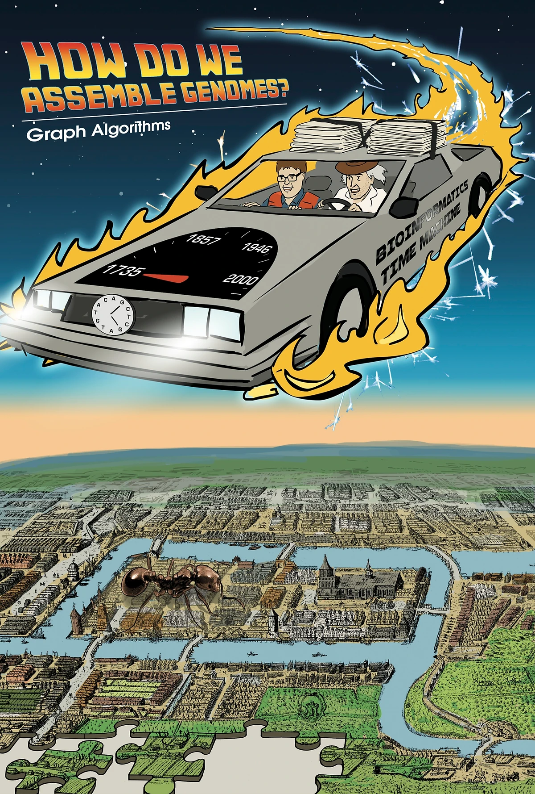
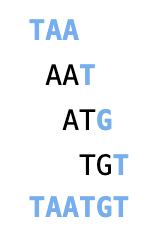
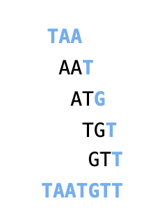
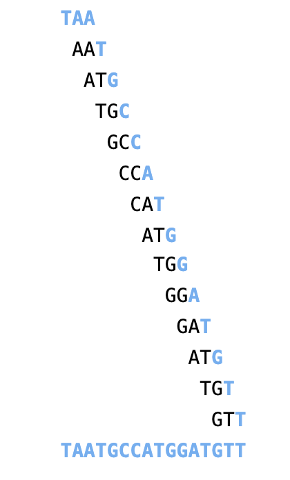
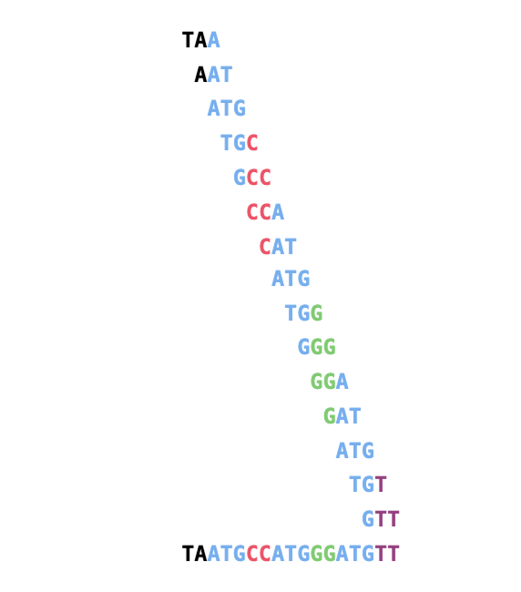
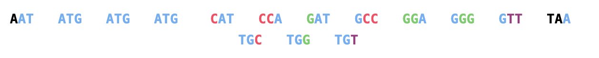
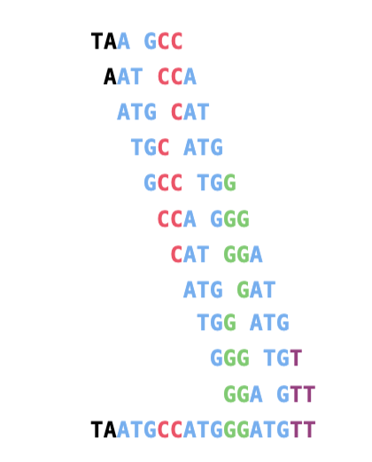
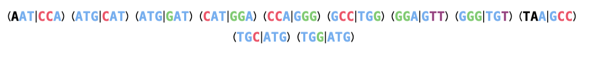
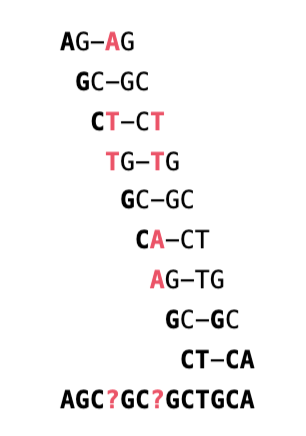

# Chapter 3 : How do we assemble genomes?




# Lesson 3.1 : Exploding Newspapers

Imagine that we stack a hundred copies of the June 27, 2000 edition of the New York Times on a pile of dynamite, and then we light the fuse. We ask you to further suspend your disbelief and assume that the newspapers are not all incinerated but instead explode cartoonishly into smoldering pieces of confetti. How could we use the tiny snippets of newspaper to figure out what the news was on June 27, 2000? We will call this crazy conundrum the Newspaper Problem.


*Figure: Don’t try this at home! Crazy as it may seem, the Newspaper Problem serves as an analogy for the computational framework of genome assembly.*

The Newspaper Problem is even more difficult than it may seem. Because we had multiple copies of the same edition of the newspaper, and because we undoubtedly lost some information in the blast, we cannot simply glue together one of the newspaper copies in the same way that we would assemble a jigsaw puzzle. Instead, we need to use overlapping fragments from different copies of the newspaper to reconstruct the day’s news, as shown in the figure below.


*Figure: In the Newspaper Problem, we need to use overlapping shreds of paper to figure out the news.*

Fine, you ask, but what do exploding newspapers have to do with biology? Determining the order of nucleotides in a genome, or genome sequencing, presents a fundamental task in bioinformatics. Genomes vary in length; your own genome is roughly 3 billion nucleotides long, whereas the genome of Amoeba dubia, an amorphous unicellular organism, is approximately 200 times longer! This unicellular organism competes with the rare Japanese flower Paris japonica for the title of species with the longest genome.

The first sequenced genome, belonging to a φX174 bacterial phage (i.e., a virus that preys on bacteria), had only 5,386 nucleotides and was completed in 1977 by Frederick Sanger. Four decades after this Nobel Prize-winning discovery, genome sequencing has raced to the forefront of bioinformatics research, as the cost of sequencing plummeted. Because of the decreasing cost of sequencing, we now have thousands of sequenced genomes, including those of many mammals (see below).


*Figure: The first mammals with sequenced genomes.*

To sequence a genome, we must clear some practical hurdles. The largest obstacle is the fact that biologists still lack the technology to read the nucleotides of a genome from beginning to end in the same way that you would read a book. The best they can do is sequence much shorter DNA fragments called reads. The reasons why researchers can sequence small pieces of DNA but not long genomes warrant their own discussion. For more details, see "DETOUR: A Short History of DNA Sequencing Technologies" in the print companion or at Cogniterra.

In this chapter, however, our aim is to turn an apparent handicap into a useful tool for putting the genome back together.

The traditional method for sequencing genomes is described as follows. Researchers take a small tissue or blood sample containing millions of cells with identical DNA, use biochemical methods to break the DNA into fragments, and then sequence these fragments to produce reads (see figure below).

The difficulty is that researchers do not know where in the genome these reads came from, and so they must use overlapping reads to reconstruct the genome. Thus, putting a genome back together from its reads, or genome assembly, is just like the Newspaper Problem.


*Figure: In DNA sequencing, many identical copies of a genome are broken in random locations to generate short reads, which are then sequenced and assembled into the nucleotide sequence of the genome.*

Even though researchers have sequenced many genomes, a giant genome like that of Amoeba dubia still remains beyond the reach of modern sequencing technologies. You might guess that the barrier to sequencing such a genome would be experimental, but that is not true; biologists can easily generate enough reads to analyze a large genome, but assembling these reads still presents a major computational challenge.

# Lesson 3.2 : The String Reconstruction Problem

## <center> Genome assembly is more difficult than you think <center>

Before we introduce a computational problem modeling genome assembly, we will take a moment to discuss a few practical complications that make genome assembly more difficult than the Newspaper Problem.

First, DNA is **double-stranded**, and we have no way of knowing a priori which strand a given read derives from, meaning that we will not know whether to use a read or its reverse complement when assembling a particular strand of a genome. Second, **modern sequencing machines are not perfect**, and the reads that they generate often contain errors. Sequencing errors complicate genome assembly because they prevent us from identifying all overlapping reads. Third, **some regions of the genome may not be covered by any reads**, making it impossible to reconstruct the entire genome.

Since the reads generated by modern sequencers often have the same length, we may safely assume that reads are all k-mers for some value of k. The first part of this chapter will assume an ideal — and unrealistic — situation in which all reads come from the same strand, have no errors, and exhibit perfect coverage, so that every k-mer substring of the genome is generated as a read. Later, we will show how to relax these assumptions for more realistic datasets.

## <center> Reconstructing strings from k-mers</center>
We are now ready to define a computational problem modeling genome assembly. Given a string Text, its k-mer composition Compositionk(Text) is the collection of all k-mer substrings of Text (including repeated k-mers). For example,

```python 
Composition3(TATGGGGTGC) = {ATG, GGG, GGG, GGT, GTG, TAT, TGC, TGG}.
```

Note that we have listed k-mers in lexicographic order (i.e., how they would appear in a dictionary) rather than in the order of their appearance in TATGGGGTGC. We have done this because the correct ordering of the reads is unknown when they are generated.

String Composition Problem: Generate the k-mer composition of a string.

- Input: An integer k and a string Text.
- Output: Compositionk(Text), where the k-mers are arranged in lexicographic order.

**Code Challenge**: Solve the String Composition Problem. (Solve at Cogniterra or[ Rosalind](https://rosalind.info/problems/ba3a/).)

- Input: An integer k and a string Text.
- Output: Compositionk(Text).
Solving the String Composition Problem is a straightforward exercise, but in order to model genome assembly, we need to solve its inverse problem.

String Reconstruction Problem: Reconstruct a string from its k-mer composition.

- Input: An integer k and a collection Patterns of k-mers.
- Output: A string Text with k-mer composition equal to Patterns (if such a string exists).
Before we ask you to solve the String Reconstruction Problem, let’s consider the following example of a 3-mer composition:

<center> AAT   ATG   GTT   TAA   TGT </center>


The most natural way to solve the String Reconstruction Problem is to mimic the solution of the Newspaper Problem and "connect" a pair of k-mers if they overlap in k-1 symbols. For the above example, it is easy to see that the string should start with TAA because there is no 3-mer ending in TA. This implies that the next 3-mer in the string should start with AA. There is only one 3-mer satisfying this condition, AAT:

<center>TAA   AAT </center>

In turn, AAT can only be extended by ATG, which can only be extended by TGT, and so on, leading us to reconstruct TAATGTT:


It looks like we are finished with the String Reconstruction Problem and can let you move on to the next chapter. To be sure, let’s consider an additional 3-mer composition:

AAT  ATG  ATG  ATG  CAT  CCA  GAT  GCC  GGA  GGG  GTT  TAA  TGC  TGG  TGT

STOP and Think: Reconstruct a string with this composition.

If we start again with TAA, then the next 3-mer in the string should start with AA, and there is only one such 3-mer, AAT. In turn, AAT can only be extended by ATG.


ATG can be extended either by TGC, or TGG, or TGT. Now we must decide which of these 3-mers to choose. Let’s select TGT:



After TGT, our only choice is GTT:



Unfortunately, now we are stuck at GTT because no 3-mers in the composition start with TT! We could try to extend TAA to the left, but no 3-mers in the composition end with TA.

You may have found this trap on your own and already discovered how to escape it. Like a good chess player, if you think a few steps ahead, then you would never extend ATG by TGT until reaching the end of the genome. With this thought in mind, let’s take a step back, extending ATG by TGC instead:


Continuing the process, we obtain the following assembly:




Yet this assembly is incorrect because we have only used fourteen of the fifteen 3-mers in the composition (we omitted GGG), making our reconstructed genome one nucleotide too short.

## <center>Repeats complicate genome assembly</center>
The difficulty in assembling this simulated genome arises because ATG is repeated three times in the 3-mer composition, which causes us to have the three choices TGG, TGC, and TGT by which to extend ATG. Repeated substrings in the genome are not a serious problem when we have just 15 reads, but with millions of reads, repeats make it much more difficult to "look ahead" and construct the correct assembly.

If you followed our discussion of finding the origin of replication in bacterial genomes, you know how unlikely it is to witness a long repeat in a randomly generated sequence of nucleotides. You also know that real genomes are anything but random. Indeed, approximately 50% of the human genome is made up of repeats, e.g., the approximately 300 nucleotide-long Alu sequence is repeated over a million times, with only a few nucleotides inserted/deleted/substituted each time. For more details, see "DETOUR: Repeats in the Human Genome" in the print companion or at Cogniterra.

An analogy illustrating the difficulty of assembling a genome with many repeats is the Triazzle® jigsaw puzzle (shown below). People usually put together jigsaw puzzles by connecting matching pieces. However, every piece in the Triazzle matches more than one other piece; in the Triazzle below, each frog appears several times. If you proceed carelessly, then you will likely match most of the pieces but fail to fit the remaining ones. And yet the Triazzle has only sixteen pieces, which should give us pause about assembling a genome from millions of reads.

STOP and Think: Design a strategy for assembling the Triazzle puzzle.


*Figure: Each Triazzle has only sixteen pieces but carries a warning: "It's Harder than it Looks!"*

# Lesson 3.3 : String Reconstruction as a Walk in the Overlap Graph

## <center>From a string to a graph</center>
Repeats in a genome necessitate some way of looking ahead to see the correct assembly in advance. Returning to our above example, you may have already found that TAATGCCATGGGATGTT is a solution to the String Reconstruction Problem for the collection of fifteen 3-mers in the last section, as illustrated below. Note that we use a different color for each interval of the string between occurrences of ATG.



STOP and Think: Is this the only solution to the String Reconstruction Problem for this collection of 3-mers?

In the figure below, consecutive 3-mers in TAATGCCATGGGATGTT are linked together to form this string's genome path.


*Figure: The fifteen color-coded 3-mers making up TAATGCCATGGGATGTT are joined into the genome path according to their order in the genome.*

String Spelled by a Genome Path Problem. Reconstruct a string from its genome path.

- Input: A sequence path of k-mers Pattern1, … ,Patternn such that the last k - 1 symbols of Patterni are equal to the first k-1 symbols of Patterni+1 for 1 ≤ i ≤ n-1.
- Output: A string Text of length k+n-1 such that the i-th k-mer in Text is equal to Patterni (for 1 ≤ i ≤ n).
Reconstructing the genome from its genome path is easy: as we proceed from left to right, the 3-mers “spell’ out TAATGCCATGGGATGTT, adding one new symbol to the genome at each new 3-mer.  This yields a function PathToGenome(path).

Unfortunately, constructing the genome path requires us to know the genome in advance.

**Code Challenge**: Solve the String Spelled by a Genome Path Problem. (Solve on Cogniterra or [Rosalind](https://rosalind.info/problems/ba3b/).)

STOP and Think: Could you construct the genome path if you knew only the genome’s 3-mer composition?

In this chapter, we will use the terms prefix and suffix to refer to the first k − 1 nucleotides and last k − 1 nucleotides of a k-mer, respectively. For example, Prefix(TAA) = TA and Suffix(TAA) = AA. We note that the suffix of a 3-mer in the genome path is equal to the prefix of the following 3-mer in the path. For example, Suffix(TAA) = Prefix(AAT) = AA in the genome path for TAATGCCATGGGATGTT, shown again below.


This observation suggests a method of constructing a string's genome path from its k-mer composition: we will use an arrow to connect any k-mer Pattern to a k-mer Pattern' if the suffix of Pattern is equal to the prefix of Pattern'.

STOP and Think: Apply this rule to the 3-mer composition of TAATGCCATGGGATGTT. Are you able to reconstruct the genome path for TAATGCCATGGGATGTT?

If we strictly follow the rule of connecting two 3-mers with an arrow every time the suffix of one is equal to the prefix of the other, then we will connect all consecutive 3-mers in TAATGCCATGGGATGTT. However, because we don’t know this genome in advance, we wind up having to connect many other pairs of 3-mers as well. For example, each of the three occurrences of ATG should be connected to TGC, TGG, and TGT, as shown in the figure below.


*Figure: The graph showing all connections between nodes representing the 3-mer composition of TAATGCCATGGGATGTT. This graph has fifteen nodes and 28 edges. Note that the genome can still be spelled out by walking along the horizontal edges from TAA to GTT.*

The figure above presents an example of a graph, or a network of nodes connected by edges. This particular graph is an example of a directed graph, whose edges have a direction and are represented by arrows (as opposed to undirected graphs whose edges do not have directions). If you are unfamiliar with graphs, see "DETOUR: An Introduction to Graphs" in the print companion or at Cogniterra.


## <center>The genome vanishes</center>


The genome can still be traced out in the graph from the previous page (reproduced above) by following the horizontal path from TAA to GTT. But in genome sequencing, we do not know in advance how to correctly order reads. Therefore, we will arrange the 3-mers lexicographically, which produces the overlap graph shown in the figure below. The genome path has disappeared!


*Figure: The same graph as the one in the figure at the top of the page, with 3-mers ordered lexicographically. The path through the graph representing the correct assembly is now harder to see.*

The genome path may have disappeared to the naked eye, but it must still be there, since we have simply rearranged the nodes of the graph.

Indeed, the figure below highlights the genome path spelling out TAATGCCATGGGATGTT. However, if we had given you this graph to begin with, you would have needed to find a path through the graph visiting each node exactly once; such a path "explains" all the 3-mers in the 3-mer composition of the genome. Although finding such a path is currently just as difficult as trying to assemble the genome by hand, the graph nevertheless gives us a nice way of visualizing the overlap relationships between reads.


*Figure: The genome path spelling out TAATGCCATGGGATGTT, highlighted in the overlap graph.*

STOP and Think: Can any other strings be reconstructed by following a path visiting all the nodes in the figure above?

To generalize the construction of the above graph to an arbitrary collection of k-mers Patterns, we form a node for each k-mer in Patterns and connect k-mers Pattern and Pattern' by a directed edge if Suffix(Pattern) is equal to Prefix(Pattern'). The resulting graph is called the overlap graph on these k-mers, denoted Overlap(Patterns).

Overlap Graph Problem: Construct the overlap graph of a collection of k-mers.

Input: A collection Patterns of k-mers.
Output: The overlap graph Overlap(Patterns).!


## <center>Two graph representations</center>

If you have never worked with graphs before, you may be wondering how to represent graphs in your programs. To make a brief digression from our discussion of genome assembly, consider the graph in the figure below. We can move around this graph’s nodes without changing the graph. As a result, when we are representing a graph computationally, the only information we need to store is the pair of nodes that each edge connects.

There are two standard ways of representing a graph. For a directed graph with n nodes, the n × n adjacency matrix (Ai,j) is defined by the following rule: Ai,j = 1 if a directed edge connects node i to node j, and Ai,j = 0 otherwise. Another (more memory-efficient) way of representing a graph is to use an adjacency list, for which we simply list all nodes connected to each node. See figure below.


*Figure: A graph with five nodes and nine edges, followed by its adjacency matrix and adjacency list.*

You should now be ready to apply your knowledge to solve the Overlap Graph Problem.

**Code Challenge**: Solve the Overlap Graph Problem, restated below. (Solve on Cogniterra or [Rosalind](https://rosalind.info/problems/ba3c/).)

- Input: A collection Patterns of k-mers.
- Output: The overlap graph Overlap(Patterns), in the form of an adjacency list. (You may return the nodes and their edges in any order.)
## <center>Hamiltonian paths and universal strings</center>

We now know that to solve the String Reconstruction Problem, we are looking for a path in the overlap graph that visits every node exactly once. A path in a graph visiting every node once is called a Hamiltonian path, in honor of the Irish mathematician William Hamilton. 

For more details, see "DETOUR: The Icosian Game" in the print companion or at Cogniterra.

As the figure below illustrates, a graph may have more than one Hamiltonian path.


*Figure: In addition to the Hamiltonian path that reconstructs TAATGCCATGGGATGTT, another Hamiltonian path in the overlap graph spells the genome TAATGGGATGCCATGTT. These two genomes differ by exchanging the positions of CC and GG but have the same 3-mer composition.*

Hamiltonian Path Problem: Construct a Hamiltonian path in a graph.

- Input: A directed graph.
- Output: A path visiting every node in the graph exactly once (if such a path exists).
We do not ask you to solve the Hamiltonian Path Problem yet, since it is not clear how we could design an efficient algorithm for it. Instead, we want you to meet Nicolaas de Bruijn, a Dutch mathematician. In 1946, de Bruijn was interested in solving a purely theoretical problem, described as follows. A binary string is a string composed only of 0’s and 1’s; a binary string is k-universal if it contains every binary k-mer exactly once. For example, 0001110100 is a 3-universal string, as it contains each of the eight binary 3-mers (000, 001, 011, 111, 110, 101, 010, and 100) exactly once.

Finding a k-universal string is equivalent to solving the String Reconstruction Problem when the k-mer composition is the collection of all binary k-mers. Thus, finding a k-universal string can be reduced to finding a Hamiltonian path in the overlap graph formed on all binary k-mers (see the figure below). Although the Hamiltonian path below can easily be found by hand, de Bruijn was interested in constructing k-universal strings for arbitrary values of k. For example, to find a 20-universal string, you would have to consider a graph with over a million nodes. It is absolutely unclear how to find a Hamiltonian path in such a huge graph, or even whether such a path exists!


*Figure: A Hamiltonian path (connecting node 000 to 100) in the overlap graph of all binary 3-mers.*

Instead of searching for Hamiltonian paths in huge graphs, de Bruijn developed a completely different (and somewhat non-intuitive) way of representing a k-mer composition using a graph. Later in this chapter, we will learn how he used this method to construct universal strings.

## **Exercise Break**: Construct a 4-universal string.

# Lesson 3.4 : Another Graph for String Reconstruction

## <center>Gluing nodes and de Bruijn graphs</center>
Let’s again represent the genome TAATGCCATGGGATGTT as a sequence of its 3-mers:

TAA   AAT   ATG   TGC   GCC   CCA   CAT   ATG   TGG   GGG   GGA   GAT   ATG   TGT   GTT

This time, instead of assigning these 3-mers to nodes, we will assign them to edges, as shown in the figure below. 


*Figure: Genome TAATGCCATGGGATGTT represented as a path, with edges (rather than nodes) labeled by 3-mers.*

You can once again reconstruct the genome by following this path from left to right, adding one new nucleotide at each step. Since each pair of consecutive edges represents consecutive 3-mers that overlap in two nucleotides, we will label each node of this graph with a 2-mer representing the overlapping nucleotides shared by the edges on either side of the node. For example, the node with incoming edge CAT and outgoing edge ATG is labeled AT.


*Figure: Genome TAATGCCATGGGATGTT represented as a path with edges (rather than nodes) labeled by 3-mers and nodes labeled by 2-mers.*

Nothing seems new here until we start gluing identically labeled nodes. In the figure below, we bring the three AT nodes closer and closer to each other until they have been glued into a single node.


*Figure: Bringing the three nodes labeled AT closer (left) and closer (middle) to each other to eventually glue them into a single node (right). The path with sixteen nodes from the previous step has been transformed into a graph with fourteen nodes.*

Note that there are also three nodes labeled by TG, which we bring closer and closer to each other in the figure below until they are glued into a single node.


*Figure: Bringing the three nodes labeled TG closer (left) and closer (middle) to each other to eventually glue them into a single node (right). The path with 16 nodes has been transformed into a graph with twelve nodes.*

Finally, we glue together the two nodes labeled GG (GG and GG), which produces a special type of edge called a loop connecting GG to itself. The number of nodes in the resulting graph (shown on the right below) has reduced from sixteen to eleven, while the number of edges stayed the same. This graph is called the de Bruijn graph of TAATGCCATGGGATGTT, denoted DeBruijn3( TAATGCCATGGGATGTT). Note that the de Bruijn graph below has three different edges connecting AT to TG (representing three copies of the repeat ATG).


*Figure: Bringing the two nodes labeled GG closer (left) and closer (middle) to each other to eventually glue them into a single node (right). The path with sixteen nodes has been transformed into the graph DeBruijn3(TAATGCCATGGGATGTT), which has eleven nodes.*

In general, given a genome Text, PathGraphk(Text) is the path consisting of |Text| - k + 1 edges, where the i-th edge of this path is labeled by the i-th k-mer in Text and the i-th node of the path is labeled by the i-th (k - 1)-mer in Text. The de Bruijn graph DeBruijnk(Text) is formed by gluing identically labeled nodes in PathGraphk(Text).

De Bruijn Graph from a String Problem: Construct the de Bruijn graph of a string.

- Input: An integer k and a string Text.
- Output: DeBruijnk(Text).
Note: To see how gluing affects the adjacency matrix and adjacency list, check out "Charging Station: The Effect of Gluing on the Adjacency Matrix and Adjacency List" in the print companion or at Cogniterra.

**Code Challenge**: Solve the De Bruijn Graph from a String Problem. (Solve on Cogniterra or [Rosalind](https://rosalind.info/problems/ba3d/).)

- Input: An integer k and a string Text.
- Output: DeBruijnk(Text), in the form of an adjacency list.


STOP and Think: Consider the following questions.

If we gave you the de Bruijn graph DeBruijnk(Text) without giving you Text, could you reconstruct Text?
Construct the de Bruijn graphs DeBruijn2(TAATGCCATGGGATGTT), DeBruijn3(TAATGCCATGGGATGTT), and DeBruijn4(TAATGCCATGGGATGTT). What do you notice?
How does the graph DeBruijn3(TAATGCCATGGGATGTT) compare to DeBruijn3(TAATGGGATGCCATGTT)?

# Lesson 3.5 : Walking in the de Bruijn Graph

## <center>Eulerian paths</center>

Even though we have glued together nodes to form the de Bruijn graph, we have not changed its edges, and so the path from TA to TT reconstructing the genome is still hiding in DeBruijn3(TAATGCCATGGGATGTT) (see the figure below), although this path has become “tangled" after gluing. Therefore, solving the String Reconstruction Problem reduces to finding a path in the de Bruijn graph that visits every edge exactly once. Such a path is called an Eulerian Path in honor of the great mathematician Leonhard Euler (pronounced “oiler").


*Figure: The path from TA to TT spelling out the genome TAATGCCATGGGATGTT has become “tangled" in the de Bruijn graph. The numbering of the fifteen edges of the path indicates an Eulerian path reconstructing the genome.*

Eulerian Path Problem: Construct an Eulerian path in a graph.

- Input: A directed graph.
- Output: A path visiting every edge in the graph exactly once (if it exists).
We now have an alternative way of solving the String Reconstruction Problem that amounts to finding an Eulerian path in the de Bruijn graph. But wait — to construct the de Bruijn graph of a genome, we glued together nodes of PathGraphk(Text). However, constructing this graph requires us to know the correct ordering of the k-mers in Text!

STOP and Think: Can you construct DeBruijnk(Text) if you don’t know Text but you do know its k-mer composition?

## <center>Another way to construct de Bruijn graphs</center>
The figure below represents the 3-mer composition of TAATGCCATGGGATGTT as a composition graph CompositionGraph3(TAATGCCATGGGATGTT). As with the de Bruijn graph, each 3-mer is assigned to a directed edge, with its prefix labeling the first node of the edge and its suffix labeling the second node of the edge. However, the edges of this graph are isolated, meaning that no two edges share a node.


*Figure: CompositionGraph3(TAATGCCATGGGATGTT) represents the 3-mer composition of TAATGCCATGGGATGTT using an isolated directed edge for each 3-mer.*

STOP and Think: Glue identically labeled nodes in CompositionGraph3(TAATGCCATGGGATGTT). How does the resulting graph compare to DeBruijn3(TAATGCCATGGGATGTT)?

The figure below shows how CompositionGraph3(TAATGCCATGGGATGTT) changes after gluing nodes with the same label. These operations glue the fifteen isolated edges in CompositionGraph3(TAATGCCATGGGATGTT) into a path PathGraph3(TAATGCCATGGGATGTT). Follow-up gluing operations proceed in exactly the same way as when we glued nodes of PathGraph3(TAATGCCATGGGATGTT), which results in DeBruijn3(TAATGCCATGGGATGTT). Thus, we can construct the de Bruijn graph from this genome's 3-mer composition without knowing the genome!


For an arbitrary string Text, we define CompositionGraphk(Text) as the graph consisting of |Text|−k+1 isolated edges, where edges are labeled by k-mers in Text; every edge labeled by a k-mer edge connects nodes labeled by the prefix and suffix of this k-mer. The graph CompositionGraphk(Text) is just a collection of isolated edges representing the k-mers in the k-mer composition of Text, meaning that we can construct CompositionGraph(Text) from the k-mer composition of Text. Gluing nodes with the same label in CompositionGraphk(Text) produces DeBruijnk(Text). Thus, we can construct the de Bruijn graph of a genome without knowing the genome!

STOP and Think: In the figure from the previous step, reproduced below, we identified ATG and TGC as overlapping 3-mers. In reality, since the genome is unknown, we don’t know whether this ATG is followed by TGC, TGG, or TGT. What would happen if we had identified ATG and TGG as overlapping 3-mers instead? Verify that the final result will be the same de Bruijn graph that we derived earlier.

.png>)


Given an arbitrary collection of k-mers Patterns (where some k-mers may appear multiple times), we define CompositionGraph(Patterns) as a graph with |Patterns| isolated edges. Every edge is labeled by a k-mer from Patterns, and the starting and ending nodes of an edge are labeled by the prefix and suffix of the k-mer labeling that edge. We then define DeBruijn(Patterns) by gluing identically labeled nodes in CompositionGraph(Patterns), which yields the following algorithm.

```python

DeBruijn(Patterns)
    dB ← graph in which every k-mer in Patterns is isolated edge between its prefix and suffix
    dB ← graph resulting from gluing all nodes in dB with identical labels
    return dB
    
```
## <center>Constructing de Bruijn graphs from k-mer composition</center>
Constructing the de Bruijn graph by gluing identically labeled nodes will help us later when we generalize the notion of de Bruijn graph for other applications. We will now describe another useful way to construct de Bruijn graphs without gluing.

Given a collection of k-mers Patterns, the nodes of DeBruijnk(Patterns) are simply all unique (k−1)-mers occurring as a prefix or suffix in Patterns. For example, say we are given the following collection of 3-mers:



Then the set of eleven unique 2-mers occurring as a prefix or suffix of 3-mers in this collection is as follows:


For every k-mer in Patterns, we connect its prefix node to its suffix node by a directed edge in order to produce DeBruijn(Patterns). You can verify that this process produces the same de Bruijn graph that we have been working with (shown below).


*Figure: The graph above is the de Bruijn graph we have been working with, although we have drawn it differently.*

DeBruijn Graph from k-mers Problem: Construct the de Bruijn graph from a set of k-mers.

Input: A collection of k-mers Patterns.
Output: The adjacency list of the de Bruijn graph DeBruijn(Patterns).
**Code Challenge**:Solve the de Bruijn Graph from k-mers Problem. (Solve at Cogniterra or [Rosalind](https://rosalind.info/problems/ba3e/).)


## <center>De Bruijn graphs versus overlap graphs</center>
We now have two ways of solving the String Reconstruction Problem. We can either find a Hamiltonian path in the overlap graph (top) or find an Eulerian path in the de Bruijn graph (bottom). Your inner voice may have already started complaining: was it really worth my time to learn two slightly different ways of solving the same problem? After all, we have only changed a single word in the statements of the Hamiltonian and Eulerian Path Problems, from finding a path visiting every node exactly once to finding a path visiting every edge exactly once.


STOP and Think: Which graph would you rather work with, the overlap graph or the de Bruijn graph?

Our guess is that you would prefer working with the de Bruijn graph, since it is smaller. However, this would be the wrong reason to choose one graph over the other. In the case of real assembly problems, both graphs will have millions of nodes, and so all that matters is finding an efficient algorithm for reconstructing the genome. If we can find an efficient algorithm for the Hamiltonian Path Problem, but not for the Eulerian path Problem, then you should select the overlap graph even though it looks more complex.

The choice between these two graphs is the pivotal decision of this chapter. To help you make this decision, we will ask you to hop onboard our bioinformatics time machine for a field trip to the 18th Century.


# <center>Lesson 3.6 : The Seven Bridges of Konigsberg</center>
Our destination is 1735 and the Prussian city of Königsberg. This city, which today is Kaliningrad, Russia, comprised both banks of the Pregel River as well as two river islands; seven bridges connected these four different parts of the city, as illustrated below. Königsberg’s residents enjoyed taking walks, and they asked a natural question: Is it possible to set out from my house, cross each bridge exactly once, and return home? Their question became known as the Bridges of Königsberg Problem.

*Figure: A map of Königsberg, adapted from Joachim Bering’s 1613 illustration. The city was made up of four sectors represented by the blue, red, yellow, and green dots. The seven bridges connecting the different parts of the city have been highlighted to make them easier to see.*


Exercise Break: Does the Bridges of Königsberg Problem have a solution?


In 1735, Leonhard Euler drew the graph shown below, which we call Königsberg; this graph’s nodes represent the four sectors of the city, and its edges represent the seven bridges connecting different sectors. Note that the edges of Königsberg are undirected, meaning that they can be traversed in either direction.

*Figure: The graph Königsberg.*

STOP and Think: Redefine the Bridges of Königsberg Problem as a question about the graph Königsberg.

We have already defined an Eulerian path as a path in a graph traversing each edge of a graph exactly once. A cycle that traverses each edge of a graph exactly once is called an Eulerian cycle, and we say that a graph containing such a cycle is Eulerian. Note that an Eulerian cycle in Königsberg would immediately provide the residents of the city with the walk they had wanted. We now can redefine the Bridges of Königsberg Problem as an instance of the following more general problem.

Eulerian Cycle Problem: Find an Eulerian cycle in a graph.

- Input: A graph.
- Output: An Eulerian cycle in this graph, if one exists.
Euler solved the Bridges of Königsberg Problem, showing that no walk can cross each bridge exactly once (i.e., the graph Königsberg is not Eulerian), which you may have already figured out for yourself. Yet his real contribution, and the reason why he is viewed as the founder of the mathematical field of graph theory, a field of study that still flourishes today, is that he proved a theorem dictating precisely when a graph will have an Eulerian cycle. His theorem immediately implies an efficient algorithm for constructing an Eulerian cycle in any Eulerian graph, even one having millions of edges. Furthermore, this algorithm can easily be extended into an algorithm constructing an Eulerian path (in a graph having such a path), which will allow us to solve the String Reconstruction Problem by using the de Bruijn graph.

On the other hand, it turns out that no one has ever been able to find an efficient algorithm solving the Hamiltonian Path Problem. The search for such an algorithm, or for a proof that an efficient algorithm does not exist for this problem, is at the heart of one of the most fundamental unanswered questions in computer science. Computer scientists classify an algorithm as polynomial if its running time can be bounded by a polynomial in the length of the input data. On the other hand, an algorithm is exponential if its runtime on some datasets is exponential in the length of the input data. Although Euler's algorithm is polynomial, the Hamiltonian Path Problem belongs to a special class of problems for which all attempts to develop a polynomial algorithm have failed (see "DETOUR: Tractable and Intractable Problems" in the print companion or at Cogniterra). Yet instead of trying to solve a problem that has stumped computer scientists for four decades, we will set aside the overlap graph and instead focus on the de Bruijn graph approach to genome assembly.

For the first two decades following the invention of DNA sequencing methods, biologists assembled genomes using overlap graphs, since they failed to recognize that the Bridges of Königsberg held the key to DNA assembly. (For more details, see "DETOUR: From Euler to Hamilton to de Bruijn" in the print companion or at Cogniterra.) Indeed, overlap graphs were used to assemble the human genome. It took bioinformaticians some time to figure out that the de Bruijn graph, first constructed to solve a completely theoretical problem, was relevant to genome assembly. Moreover, when the de Bruijn graph was brought to bioinformatics, it was considered an exotic mathematical concept with limited practical applications. Today, the de Bruijn graph has become the dominant approach for genome assembly.

# <center>Lesson 3.7 : Euler's Theorem</center>

We will now explore Euler’s method for solving the Eulerian Cycle Problem. Euler worked with undirected graphs like Königsberg, but we will consider an analogue of his algorithm for directed graphs so that his method will apply to genome assembly.

Consider an ant, whom we will call Leo, walking along the edges of an Eulerian cycle. Every time Leo enters a node of this graph by an edge, he is able to leave this node by another, unused edge. Thus, in order for a graph to be Eulerian, the number of incoming edges at any node must be equal to the number of outgoing edges at that node. We define the indegree and outdegree of a node v (denoted in(v) and out(v), respectively) as the number of edges leading into and out of v. A node v is balanced if in(v) = out(v), and a graph is balanced if all its nodes are balanced. Because Leo must always be able to leave a node by an unused edge, any Eulerian graph must be balanced. The figure below shows a balanced graph and an unbalanced graph.


  *Figure: Balanced (left) and unbalanced (right) directed graphs. For the (unbalanced) blue node v, in(v) = 1 and out(v) = 2, whereas for the (unbalanced) red node w, in(w) = 2 and out(w) = 1.*

STOP and Think: We now know that every Eulerian graph is balanced; is every balanced graph Eulerian?

The graph in the figure below is balanced but not Eulerian because it is disconnected, meaning that some nodes cannot be reached from other nodes. In any disconnected graph, it is impossible to find an Eulerian cycle. In contrast, we say that a directed graph is strongly connected if it is possible to reach any node from every other node. We now know that an Eulerian graph must be both balanced and strongly connected. Euler’s Theorem states that these two conditions are sufficient to guarantee that an arbitrary graph is Eulerian. As a result, it implies that we can determine whether a graph is Eulerian without ever having to draw any cycles.

Euler’s Theorem: Every balanced, strongly connected directed graph is Eulerian.

For the rest of this lesson, we will prove Euler's Theorem by assuming we have an arbitrary balanced and strongly connected directed graph and showing that this graph must have an Eulerian cycle.


*Figure: A balanced, disconnected graph.*


*Figure: Leo starts at the green node v0 and walks through a balanced and strongly connected graph.*

Let Graph be an arbitrary balanced and strongly connected directed graph. To prove that Graph has an Eulerian cycle, place Leo at any node v0 of Graph (the green node in the figure above), and let him randomly walk through the graph under the condition that he cannot traverse the same edge twice.

If Leo were incredibly lucky — or a genius — then he would traverse each edge exactly once and return back to v0. However, odds are that Leo will “get stuck" somewhere before he can complete an Eulerian cycle, meaning that he reaches a node and finds no unused edges leaving that node.

STOP and Think: Where is Leo when he gets stuck? Can he get stuck in any node of the graph or only in some nodes?

*Figure: Leo produces a cycle Cycle0 (formed by green edges) when he gets stuck at the green node v0. In this case, he has not yet visited every edge in the graph.*

It turns out that the only node where Leo can get stuck is the starting node v0! The reason why is that Graph is balanced — if Leo walks into any node other than v0 (through an incoming edge), then he will always be able to escape via an unused outgoing edge. The only exception to this rule is the starting node v0, since Leo used up one of the outgoing edges of v0 on his first move. Now, because Leo has returned to v0, the result of his walk was a cycle, which we call Cycle0 (see the figure above).

STOP and Think: Is there a way to give Leo different instructions so that he selects a longer walk through the graph before he gets stuck?

*Figure: Starting at a new node v1 (shown in blue), Leo first travels along Cycle0, returning to v1. Note that v1, unlike v0, has unused outgoing and incoming edges.*

As we mentioned, if Cycle0 is Eulerian, we are finished. Otherwise, because Graph is strongly connected, some node on Cycle0 must have unused edges entering it and leaving it (why?). Naming this node v1 , we ask Leo to start at v1 instead of v0 and traverse Cycle0 (thus returning to v1), as shown in the figure above.

*Figure: After traversing the previously constructed green cycle Cycle0, Leo continues walking and eventually produces a larger cycle Cycle1 formed of both the green and the blue cycles put together into a single cycle.*

Leo is probably annoyed that we have asked him to travel along the exact same cycle, since as before, he will eventually get stuck at v1, the node where he started. However, now there are unused edges starting at this node, and so he can continue walking from v1, using a new edge each time. The same argument as the one that we used above implies that Leo must eventually get stuck at v1. The result of Leo’s walk is a new cycle, Cycle1 (see the figure above), that is larger than Cycle0.


*Figure: (Left) Starting at a new node v2 (shown in red), the ant first travels along the previously constructed Cycle1 (shown as green and blue edges). (Right) After completing the walk through Cycle1, the ant continues randomly walking through the graph and finally produces an Eulerian cycle.*

If Cycle1 is an Eulerian cycle, then Leo has completed his job. Otherwise, we select a node v2 in Cycle1 that has unused edges entering it and leaving it (the red node in the figure above). Starting at v2, we ask Leo to traverse Cycle1, returning to v2 as shown in the right panel above. Afterwards, he will randomly walk until he gets stuck at v2, creating an even larger cycle that we name Cycle2.

In the figure above, Cycle2 is Eulerian, although this is certainly not the case for an arbitrary graph. In general, Leo generates larger and larger cycles at each iteration, and so we are guaranteed that sooner or later some Cyclem will traverse all the edges in Graph. This cycle must be Eulerian, and so we (and Leo) are finished.

STOP and Think: Can you formulate and prove an analogue of Euler’s Theorem for undirected graphs?

# Lesson 3.8 : From Euler's Theorem to an Algorithm for Finding Eulerian Cycles

## <center>Constructing Eulerian cycles</center>

The proof of Euler’s Theorem offers an example of what mathematicians call a constructive proof, which not only proves the desired result, but also provides us with a method for constructing the object we need. In short, we track Leo’s movements until he inevitably produces an Eulerian cycle in a balanced and strongly connected graph Graph, as summarized in the following pseudocode.


```python 
EulerianCycle(Graph)
    '''form a cycle Cycle by randomly walking in Graph (don't visit the same edge twice!)'''
    while there are unexplored edges in Graph
        select a node newStart in Cycle with still unexplored edges
        form Cycle’ by traversing Cycle (starting at newStart) and then randomly walking
        Cycle ← Cycle’
    return Cycle
```
You should now be prepared to solve the Eulerian Cycle Problem for any graph. It may not be obvious, but a good implementation of EulerianCycle will work in linear time. To achieve this runtime speedup, you would need to use an efficient data structure in order to maintain the current cycle that Leo is building as well as the list of unused edges incident to each node and the list of nodes on the current cycle that have unused edges.

**Code Challenge**: Solve the Eulerian Cycle Problem. (Solve at Cogniterra or [Rosalind](https://rosalind.info/problems/ba3f/).)


- Input: The adjacency list of an Eulerian directed graph.
- Output: An Eulerian cycle in this graph.

## <center>From Eulerian cycles to Eulerian paths</center>
We can now check if a directed graph has an Eulerian cycle, but what about an Eulerian path? Consider the de Bruijn graph on the left in the figure below, which we already know has an Eulerian path, but which does not have an Eulerian cycle because nodes TA and TT are not balanced. However, we can transform this Eulerian path into an Eulerian cycle by adding a single edge connecting TT and TA, as shown in the figure below.

STOP and Think: How many unbalanced nodes does a graph with an Eulerian path have?


*Figure: Transforming an Eulerian path (left) into an Eulerian cycle (right) by adding an edge.*

More generally, consider a graph that does not have an Eulerian cycle but does have an Eulerian path. If an Eulerian path in this graph connects a node v to a different node w, then the graph is nearly balanced, meaning that all its nodes except v and w are balanced. In this case, adding an extra edge from w to v transforms the Eulerian path into an Eulerian cycle. Thus, a nearly balanced graph has an Eulerian path if and only if adding an edge between its unbalanced nodes makes the graph balanced and strongly connected.

STOP and Think: Find an analogue of the nearly balanced condition that will determine when an undirected graph has an Eulerian path.

The analogue of Euler’s theorem for undirected graphs immediately implies that there is no Eulerian path in Königsberg. However, the story is different in modern-day Kaliningrad; for more details, see "DETOUR: The Bridges of Kaliningrad" in the print companion or at Cogniterra.


**Code Challenge**: Solve the Eulerian Path Problem. (Solve at Cogniterra or [Rosalind](https://rosalind.info/problems/ba3g/).)

- Input: The adjacency list of a directed graph that has an Eulerian path.
- Output: An Eulerian path in this graph.
You now have a method to assemble a genome, since the String Reconstruction Problem reduces to finding an Eulerian path in the de Bruijn graph generated from reads.

We can therefore summarize this solution using the following pseudocode, which relies on three problems that we have already solved:

The de Bruijn Graph Construction Problem;
The Eulerian Path Problem;
The String Spelled by a Genome Path Problem.

```python
    StringReconstruction(Patterns)
        dB ← DeBruijn(Patterns)
        path ← EulerianPath(dB)
        Text ← PathToGenome(path)
        return Text
```

**Code Challenge**: Solve the String Reconstruction Problem. (Solve at Cogniterra or [Rosalind](https://rosalind.info/problems/ba3h/).) 


- Input: An integer k followed by a list of k-mers Patterns.
- Output: A string Text with k-mer composition equal to Patterns. (If multiple answers exist, you may return any one.)
## <center>Constructing universal strings</center>
Now that you know how to use the de Bruijn graph to solve the String Reconstruction Problem, you can also construct a k-universal string for any value of k.

We should note that de Bruijn was interested in constructing k-universal circular strings. For example, 00011101 is a 3-universal circular string, as it contains each of the eight binary 3-mers (000, 001, 011, 111, 110, 101, 010, and 100) exactly once (see the figure below).

k-Universal Circular String Problem: Find a k-universal circular string.

- Input: An integer k.
- Output: A k-universal circular string.


*Figure: The circular 3-universal string 00011101 contains each of the binary 3-mers exactly once.*

Like its analogue for linear strings, the k-Universal Circular String Problem is just a specific case of a more general problem, which requires us to reconstruct a circular string given its k-mer composition. This problem models the assembly of a circular genome containing a single chromosome, like the genomes of most bacteria. We know that we can reconstruct a circular string from its k-mer composition by finding an Eulerian cycle in the de Bruijn graph constructed from these k-mers. Therefore, we can construct a k-universal circular binary string by finding an Eulerian cycle in the de Bruijn graph constructed from the collection of all binary k-mers (see figure below).

Exercise Break: How many 3-universal circular strings are there?


*Figure: (Top) A graph consisting of eight isolated directed edges, one for each binary 3-mer. The nodes of each edge correspond to the 3-mer’s prefix and suffix. (Bottom) Gluing identically labeled nodes in the graph on top results in a de Bruijn graph containing four nodes. An Eulerian cycle through the edges 000 → 001 → 011 → 111 → 110 → 101 → 010 → 100 yields the 3-universal circular string 00011101.*

Even though finding a 20-universal circular string amounts to finding an Eulerian cycle in a graph with over a million edges, we now have a fast algorithm for solving this problem. Let BinaryStringsk be the set of all 2k binary k-mers. The only thing we need to do is solve the k-Universal Circular String Problem is to find an Eulerian cycle in DeBruijn(BinaryStringsk). Note that the nodes of this graph represent all possible binary (k - 1)-mers. A directed edge connects (k - 1)-mer Pattern to (k - 1)-mer Pattern' in this graph if there exists a k-mer whose prefix is Pattern and whose suffix is Pattern'.

STOP and Think: The figure below illustrates that DeBruijn(BinaryStrings4) is balanced and strongly connected and is thus Eulerian. Can you prove that for any k, DeBruijn(BinaryStringsk) is Eulerian?


*Figure: An Eulerian cycle spelling the cyclic 4-universal string 0000110010111101 in DeBruijn(BinaryStrings4).*

**Code Challenge**: Solve the k-Universal Circular String Problem. (Solve at Cogniterra or [Rosalind](https://rosalind.info/problems/ba3i/).)

- Input: An integer k.
- Output: A k-universal circular string.

# Lesson 3.9 : Assembling Genomes from Read-Pairs 
# <center>From reads to read-pairs</center>

Previously, we described an idealized form of genome assembly in order to build up your intuition about de Bruijn graphs. In the rest of the chapter, we will discuss a number of practically motivated topics that will help you appreciate the advanced methods used by modern assemblers.

We have already mentioned that assembling reads sampled from a randomly generated text is trivial, since random strings are not expected to have long repeats. Moreover, de Bruijn graphs become less and less tangled when read length increases (see the figure below). As soon as read length exceeds the length of all repeats in a genome (provided the reads have no errors), the de Bruijn graph turns into a path. However, despite many attempts, biologists have not yet figured out how to generate long and accurate reads. The most accurate sequencing technologies available today generate reads that are only about 300 nucleotides long, which is too short to span most repeats, even in short bacterial genomes.


*Figure: The graph DeBruijn4(TAATGCCATGGGATGTT) (top right) is less tangled than the graph DeBruijn3(TAATGCCATGGGATGTT) (top left). The graph DeBruijn5(TAATGCCATGGGATGTT) is a path (bottom).*
           

We saw earlier that the string TAATGCCATGGGATGTT cannot be uniquely reconstructed from its 3-mer composition since another string (TAATGGGATGCCATGTT) has the same 3-mer composition.

STOP and Think: What additional experimental information would allow you to uniquely reconstruct the string TAATGCCATGGGATGTT?

Increasing read length would help identify the correct assembly, but since increasing read length presents a difficult experimental problem, biologists have devised an ingenious experimental approach to increase read length by generating read-pairs, which are pairs of reads separated by a fixed distance d in the genome (see figure below). You can think about a read-pair as a long “gapped" read of length k + d + k whose first and last k-mers are known but whose middle segment of length d is unknown. Nevertheless, read-pairs contain more information than k-mers alone, and so we should be able to use them to improve our assemblies. If only you could infer the nucleotides in the middle segment of a read-pair, you would immediately increase the read length from k to 2 · k + d.


*Figure: Read-pairs sampled from TAATGCCATGGGATGTT and formed by reads of length 3 separated by a gap of length 1. A simple but inefficient way to assemble these read-pairs is to construct the de Bruijn graph of individual reads (3-mers) within the read-pairs.*

## <center>Transforming read-pairs into long virtual reads</center>
Let Reads be the collection of all 2N k-mer reads taken from N read-pairs. Note that a read-pair formed by k-mer reads Read1 and Read2 corresponds to two edges in the de Bruijn graph DeBruijnk(Reads). Since these reads are separated by distance d in the genome, there must be a path of length k + d in DeBruijnk(Reads) connecting the node at the beginning of the edge corresponding to Read1 with the node at the beginning of the edge corresponding to Read2, as shown in the figure below. If there is only one path of length k + d + 1 connecting these nodes, or if all such paths spell out the same string, then we can transform a read-pair formed by reads Read1 and Read2 into a virtual read of length 2 · k + d that starts as Read1, spells out this path, and ends with Read2.

For example, consider the de Bruijn graph below, which is generated from all reads present in the read-pairs from the previous step. There is a unique string spelled by paths of length k + d + 1 = 5 between edges labeled AAT and CCA within a read-pair represented by the gapped read AAT-CCA. Thus, from two short reads of length k, we have generated a long virtual read of length 2 · k + d, achieving computationally what researchers still cannot achieve experimentally! After preprocessing the de Bruijn graph to produce long virtual reads, we can simply construct the de Bruijn graph from these long reads and use it for genome assembly.


*Figure: Each path of length 3 + 1 + 1 = 5 (connecting node AAT to node CCA) spells out AATGCCA. Thus, the gapped read AAT-CCA can be transformed into a long virtual read AATGCCA, shown by the highlighted path. There are three such paths because there are three possible choices of edges labeled ATG.*

Although the idea of transforming read-pairs into long virtual reads is used in many assembly programs, we have made an optimistic assumption: “If there is only one path of length k + d + 1 connecting these nodes, or if all such paths spell out the same string" In practice, this assumption limits the application of the long virtual read approach to assembling read-pairs because highly repetitive genomic regions often contain multiple paths of the same length between two edges spelling different strings (see the figure below). If this is the case, then we cannot reliably transform a read-pair into a long read. Instead, we will describe an alternative approach to analyzing read-pairs.


*Figure: (Left) The highlighted path in DeBruijn3(AATCTGACATATGG) spells out the long virtual read AATCTGACA, which is a substring of AATCTGACATATGG. (Right) The highlighted path in the same graph spells out the long virtual read AATATGACA, which does not occur in AATCTGACATATGG.*

From composition to paired composition
Given a string Text, a (k,d)-mer is a pair of k-mers in Text separated by distance d. We use the notation (Pattern1|Pattern2) to refer to a (k,d)-mer whose k-mers are Pattern1 and Pattern2. For example, (AAT|TGG) is a (3,4)-mer in TAATGCCATGGGATGTT. The (k,d)-mer composition of Text, denoted PairedCompositionk,d(Text), is the collection of all (k,d)- mers in Text (including repeated (k,d)-mers). For example, here is PairedComposition3,1(TAATGCCATGGGATGTT):

Since the order of (3,1)-mers is unknown, we list them according to the lexicographic order of the 6-mers formed by their concatenated 3-mers:



Exercise Break: Generate the (3,2)-mer composition of TAATGCCATGGGATGTT in lexicographic order. Include repeats, and return your answer as a list on a single line.  As a hint to help you with formatting, your answer should begin "(AAT|CAT) (ATG|ATG)..."

Note that while there are repeated 3-mers in the 3-mer composition of this string, there are no repeated (3,1)-mers in its paired composition. Furthermore, although TAATGCCATGGGATGTT and TAATGGGATGCCATGTT have the same 3-mer composition, they have different (3,1)-mer compositions. Thus, if we can generate the (3,1)-mer composition of these strings, then we will be able to distinguish between them. But how can we reconstruct a string from its (k,d)-mer composition? And can we adapt the de Bruijn graph approach for this purpose?

String Reconstruction from Read-Pairs Problem: Reconstruct a string from its paired composition.

- Input: A collection of paired k-mers PairedReads and an integer d.
- Output: A string Text with (k,d)-mer composition equal to PairedReads (if such a string exists).

## <center>Paired de Bruijn graphs</center>
Given a (k, d)-mer (a1 ... ak | b1 ... bk), we define its prefix as the (k − 1, d + 1)-mer (a1 ... ak -1 | b1 ... bk - 1), and its suffix as the (k - 1,d + 1)-mer (a2 ... ak | b2 ... bk). For example, Prefix((GAC|TCA)) = (GA|TC) and Suffix((GAC|TCA)) = (AC|CA).

Note that for consecutive (k, d)-mers appearing in Text, the suffix of the first (k, d)-mer is equal to the prefix of the second (k, d)-mer. For example, for the consecutive (k, d)-mers (TAA|GCC) and (AAT | CCA) in  TAATGCCATGGGATGTT, Suffix((TAA | GCC)) = Prefix((AAT | CCA))=(AA | CC).

Given a string Text, we construct a graph PathGraphk,d(Text) that represents a path formed by |Text| - ( k + d + k) + 1 edges corresponding to all (k, d)-mers in Text. We label edges in this path by (k, d)-mers and label the starting and ending nodes of an edge by its prefix and suffix, respectively. The figure below illustrates PathGraph3,1(TAATGCCATGGGATGTT).


*Figure: PathGraph3,1( TAATGCCATGGGATGTT). Each (3,1)-mer has been displayed as a two-line expression to save space.*

The paired de Bruijn graph, denoted DeBruijnk,d(Text), is formed by gluing identically labeled nodes in PathGraphk,d(Text); the figure below shows the construction of the paired de Bruijn graph DeBruijn3,1(TAATGCCATGGGATGTT). Note that the paired de Bruijn graph is less tangled than the de Bruijn graph constructed from individual reads.


*Figure: (Top) PathGraph3,1(TAATGCCATGGGATGTT) is formed by eleven edges and twelve nodes. Only two of these nodes have the same label (TG|AT). (Middle) Bringing the two identically labeled nodes closer to each other in preparation for gluing. (Bottom) The paired de Bruijn graph DeBruijn3,1(TAATGCCATGGGATGTT) is obtained from PathGraph3,1(TAATGCCATGGGATGTT) by gluing the nodes sharing the label (TG|AT). This paired de Bruijn graph has a unique Eulerian path, which spells out TAATGCCATGGGATGTT.*

STOP and Think: It is easy to construct a paired de Bruijn graph from a string Text. But how can we construct the paired de Bruijn graph from the (k,d)-mer composition of Text?

We define PairedCompositionGraphk,d(Text) as the graph consisting of |Text| - (k + d + k) + 1 isolated edges that are labeled by the (k,d)-mers in Text, and whose nodes are labeled by the prefixes and suffixes of these labels. The figure below illustrates the graph PairedCompositionGraph3,1(TAATGCCATGGGATGTT). As you may have already guessed, gluing identically labeled nodes in PairedCompositionGraphk,d(Text) results in exactly the same de Bruijn graph as gluing identically labeled nodes in PathGraphk,d(Text). In practice, we don’t know Text, but we can form PairedCompositionGraphk,d(Text) directly from the (k,d)-mer composition of Text, and the gluing step will result in the paired de Bruijn graph of this composition. The genome can be reconstructed by following an Eulerian path in this de Bruijn graph.


*Figure: The graph PairedCompositionGraph3,1(TAATGCCATGGGATGTT) is a collection of isolated edges. Each edge is labeled by a (3,1)-mer in TAATGCCATGGGATGTT; the starting node of an edge is labeled by the prefix of the edge's (3,1)-mer, and the ending node of an edge is labeled by the suffix of this (3,1)-mer. Gluing identically labeled nodes yields the paired de Bruijn graph from the previous step.*

## <center>A pitfall of paired de Bruijn graphs</center>
We saw earlier that every solution of the String Reconstruction Problem corresponds to an Eulerian path in the de Bruijn graph constructed from a k-mer com- position. Likewise, every solution of the String Reconstruction from Read-Pairs Problem corresponds to an Eulerian path in the Paired de Bruijn graph constructed from a (k,d)-mer composition.

Exercise Break: In the paired de Bruijn graph shown below, reconstruct the genome spelled by the following Eulerian path of (2,1)-mers: (AG|AG) →(GC|GC) → (CA|CT) → (AG|TG) → (GC|GC) → (CT|CT) → (TG|TG) → (GC|GC) → (CT|CA).


*Figure: A paired de Bruijn graph constructed from the collection of nine (2,1)-mers (AG|AG), (AG|TG), (CA|CT), (CT|CA), (CT|CT), (GC|GC), (GC|GC), (GC|GC), and (TG|TG).*

We also saw that every Eulerian path in the de Bruijn graph constructed from a k-mer composition spells out a solution of the String Reconstruction Problem. But is this the case for the paired de Bruijn graph?

STOP and Think: The graph shown below has another Eulerian path: (AG|AG) →(GC|GC) → (CT|CT) → (TG|TG) → (GC|GC) → (CA|CT) → (AG|TG) → (GC|GC) → (CT|CA). Can you reconstruct a genome spelled by this path?

The Exercise Break presented the following Eulerian path formed of nine edges in our graph.

AG-AG → GC-GC → CA-CT → AG-TG → GC-GC → CT-CT → TG-TG → GC-GC → CT-CA

We can arrange the (2,1)-mers in this path into the nine rows shown below, revealing the string AGCAGCTGCTGCA spelled by this path:


Now, look again at the same graph, and consider the Eulerian path presented by the STOP and Think question:

AG-AG → GC-GC → CT-CT → TG-TG → GC-GC → CA-CT → AG-TG → GC-GC → CT-CA

An attempt to assemble these (2,1)-mers reveals that not every column has the same nucleotide (see the two columns shown in red below).  This example illustrates that not not every Eulerian path in the paired de Bruijn graph constructed from (k,d)-mer composition spells out a solution of the String Reconstruction from Read-Pairs Problem.



You are now ready to reconstruct a string from read-pairs and become a genome assembly expert.

**Code Challenge**: Solve the String Reconstruction from Read-Pairs Problem. (Solve at Cogniterra or [Rosalind](https://rosalind.info/problems/ba3j/).)

- Input: Integers k and d followed by a collection of paired k-mers PairedReads.
- Output: A string Text with (k, d)-mer composition equal to PairedReads.
To solve the String Reconstruction from Read-Pairs Problem, you will need to reconstruct a string from its path in the paired de Bruijn graph. Check out "Charging Station: Reconstructing a String in the Paired de Bruijn Graph" in the print companion or at Cogniterra to see how this can be done.


# Epilogue: Genome Assembly Faces Real 

Our discussion of genome assembly has thus far relied upon various assumptions. Accordingly, applying de Bruijn graphs to real sequencing data is not a straightforward procedure. Below, we describe practical challenges introduced by quirks in modern sequencing technologies and some computational techniques that have been devised to address these challenges. In this discussion, we will first assume that reads are generated as contiguous substrings of a genome instead of read-pairs for the sake of simplicity.

## <center>Breaking reads into k-mers</center>

First, given a k-mer substring of a genome, we define its coverage as the number of reads to which this k-mer belongs.

There is also a sense of coverage in terms of how well a collection of sequencing reads "cover" the genome.  We have previously taken for granted that a sequencing machine can generate all k-mers present in the genome, but this assumption of "perfect coverage" does not hold in practice. For example, the popular Illumina sequencing technology generates reads that are approximately 300 nucleotides long, but this technology still misses many 300-mers present in the genome (even if the average coverage is very high), and nearly all the reads that it does generate have sequencing errors.  How, then, can we use these reads effectively?

The left part of the figure below shows four 10-mer reads that capture some but not all of the 10-mers from an example genome. However, if we take the counterintuitive step of breaking these reads into shorter 5-mers (figure below, right), then these 5-mers exhibit perfect coverage. This read breaking approach, in which we break reads into shorter k-mers, is used by many modern assemblers.

Read breaking must deal with a practical trade-off. On the one hand, the smaller the value of k, the larger the chance that the k-mer coverage is perfect. On the other hand, smaller values of k result in a more tangled de Bruijn graph, making it difficult to infer the genome from this graph.


*Figure: Breaking 10-mer reads (left) into 5-mers results in perfect coverage of a genome by 5-mers (right).*

## <center>Splitting the genome into contigs</center>
Even after read breaking, most assemblies still have gaps in k-mer coverage, causing the de Bruijn graph to have missing edges, and so the search for an Eulerian path fails. In this case, biologists often settle on assembling contigs (long, contiguous segments of the genome) rather than entire chromosomes. For example, a typical bacterial sequencing project may result in about a hundred contigs, ranging in length from a few thousand to a few hundred thousand nucleotides. For most genomes, the order of these contigs along the genome remains unknown. Needless to say, biologists would prefer to have the entire genomic sequence, but the cost of ordering the contigs into a final assembly and closing the gaps using more expensive experimental methods is often prohibitive.

Fortunately, we can derive contigs from the de Bruijn graph. A path in a graph is called non-branching if in(v) = out(v) = 1 for each intermediate node v of this path, i.e., for each node except possibly the starting and ending node of a path. A maximal non-branching path is a non-branching path that cannot be extended into a longer non-branching path. We are interested in these paths because the strings of nucleotides that they spell out must be present in any assembly with a given k-mer composition. For this reason, contigs correspond to strings spelled by maximal non-branching paths in the de Bruijn graph. For example, the de Bruijn graph below, constructed for the 3-mer composition of TAATGCCATGGGATGTT, has nine maximal non-branching paths that spell out the contigs TAAT, TGTT, TGCCAT, ATG, ATG, ATG, TGG, GGG, and GGAT. In practice, biologists have no choice but to break genomes into contigs, even in the case of perfect coverage (like in the figure below), since repeats prevent them from being able to infer a unique Eulerian path.


*Figure: Breaking the de Bruijn graph into nine maximal non-branching paths representing contigs TAAT, TGTT, TGCCAT, ATG, ATG, ATG, TGG, GGG, and GGAT.*

Contig Generation Problem: Generate the contigs from a collection of reads (with imperfect coverage).

- Input: A collection of k-mers Patterns.
- Output: All contigs in DeBruijn(Patterns).

**Code Challenge**: Solve the Contig Generation Problem. (Solve at Cogniterra or [Rosalind](https://rosalind.info/problems/ba3k/).)


If you have difficulties finding maximal non-branching paths in a graph, check out "Charging Station: Maximal Non-Branching Paths in a Graph" in the print companion or at Cogniterra.

## <center>Assembling error-prone reads</center>
Error-prone reads represent yet another barrier to real sequencing projects. Adding the single erroneous read CGTACGGACA (with a single error that misreads T as C) to the set of "broken" 5-mer reads from earlier in the lesson results in erroneous 5-mers CGTAC, GTACG, TACGG, ACGGA, and CGGAC after read breaking. These 5-mers result in an erroneous path from node CGTA to node GGAC in the de Bruijn graph below, meaning that if the correct read CGTATGGACA is generated as well, then we will have two paths connecting CGTA to GGAC in the de Bruijn graph. This structure is called a bubble, which we define as two short disjoint paths (e.g., shorter than some threshold length) connecting the same pair of nodes in the de Bruijn graph.

STOP and Think: What is the size of the bubble (in the de Bruijn graph constructed from k-mers) introduced by a single error in a read?


*Figure: A correct path CGTA → GTAT → TATG → ATGG → TGGA → GGAC along with an incorrect path CGTA → GTAC → TACG → ACGG → CGGA → GGAC form a “bubble" in a de Bruijn graph, making it difficult to identify which path is correct.*

STOP and Think: Design an algorithm for detecting bubbles in de Bruijn graphs. After a bubble is detected, you must decide which of two paths in the bubble to remove. How should you make this decision?

Existing assemblers remove bubbles from de Bruijn graphs. The practical challenge is that, since nearly all reads have errors, de Bruijn graphs have millions of bubbles (see below).

Bubble removal occasionally removes the correct path, thus introducing errors rather than fixing them. To make matters worse, in a genome having inexact repeats, where the repeated regions differ by a single nucleotide or some other small variation, reads from the two repeat copies will also generate bubbles in the de Bruijn graph because one of the copies may appear to be an erroneous version of the other. Applying bubble removal to these regions introduces assembly errors by making repeats appear more similar than they are. Thus, modern genome assemblers attempt to distinguish bubbles caused by sequencing errors (which should be removed) from bubbles caused by variations (which should be retained).


*Figure: An illustration of a de Bruijn graph with many bubbles. Bubble removal should leave only the colored paths remaining.*

## <center>Inferring multiplicities of edges in de Bruijn graphs</center>
Next, while the de Bruijn graph framework requires that we know the multiplicity of each k-mer in the genome (i.e., the number of times the k-mer appears), this information is not readily available from reads. However, the multiplicity of a k-mer in a genome can often be estimated using its coverage. Indeed, k-mers that appear t times in a genome are expected to have approximately t times higher coverage than k-mers that appear just once. Needless to say, coverage varies across the genome, and this condition is often violated. As a result, existing assemblers often assemble repetitive regions in genomes without knowing the exact number of times each k-mer from this region occurs in the genome.

We have introduced you to some of the practical considerations in genome sequencing, but some still remain; for example, how do we deal with the fact that genomes are double-stranded? (See "DETOUR: Pitfalls of Assembling Double-Stranded DNA" in the print companion or at Cogniterra.) In practice, researchers will eventually obtain a collection of contigs from a genome sequencing experiments, but partitioning these contigs into two groups (corresponding to each strand) is a difficult problem that modern assemblers have yet to fully resolve. For example, if an assembler outputs five contigs, it may be that contigs 1 and 3 belong to one strand while contigs 2, 4, and 5 belong to the opposing strand.

However, we will give you a challenge problem that does not encounter these issues. Why? Developing assembly algorithms for large genomes is a formidable challenge because even the seemingly simple problem of constructing the de Bruijn graph from a collection of all k-mers present in millions of reads is nontrivial. To make your life easier, we will give you a small bacterial genome for your first assembly dataset.

## <center>Final Challenge: </center>
Carsonella ruddii is a bacterium that lives symbiotically inside some insects. Its sheltered life has allowed it to reduce its genome to only about 160,000 base pairs. With only about 200 genes, it lacks some genes necessary for survival, but these genes are supplied by its insect host. In fact, Carsonella has such a small genome that biologists have conjectured that it is losing its “bacterial" identity and turning into an organelle, which is part of the host’s genome. This transition from bacterium to organelle has happened many times during evolutionary history; in fact, the mitochondrion responsible for energy production in human cells was once a free-roaming bacterium that we assimilated in the distant past.

Given a collection of simulated error-free read-pairs (with exact distance d = 1000 between reads of length k = 120 within a read-pair), use the paired de Bruijn graph to reconstruct the Carsonella ruddii genome. Compare this assembly to the assembly obtained from the classic de Bruijn graph (i.e., when all we know is the reads themselves and do not know the distance between paired reads) in order to better appreciate the benefits of read-pairs. For each k, what is the minimum value of d needed to enable reconstruction of the entire Carsonella ruddii genome from its (k,d)-mer composition?

[Challenge Dataset](final_challenge/reads.txt)

Exercise Break: By the way, one more thing … what was the headline of the June 27, 2000 edition of the New York Times?

# Bibliography Notes
After Euler’s work on the Königsberg Bridge Problem (Euler, 1758), graph theory was forgotten for over a hundred years but was revived in the second half of the 19th Century. Graph theory flourished in the 20th Century, when it became an important area of mathematics with many practical applications. The de Bruijn graph was introduced independently by Nicolaas de Bruijn (de Bruijn, 1946) and I. J. Good ( Good, 1946).

DNA sequencing methods were invented independently and simultaneously in 1977 by groups led by Frederick Sanger ( Sanger, Nicklen, and Coulson, 1977) and Walter Gilbert ( Maxam and Gilbert, 1977). A year previously, Walter Flyers and colleagues had sequenced a shorter virus called MS2, but Sanger’s approach scaled for larger genomes. DNA arrays were proposed simultaneously and independently in 1988 by Radoje Drmanac ( Drmanac et al., 1989), Andrey Mirzabekov ( Lysov et al., 1988 ) and Edwin Southern ( Southern, 1988). The Eulerian approach to DNA arrays was described in 1989 ( Pevzner, 1989).

The Eulerian approach to DNA sequencing was described by Idury and Waterman, 1995 and further developed by Pevzner, Tang, and Waterman, 2001. To address the challenge of assembly from short reads produced by next generation sequencing technologies, a number of assembly tools that are based on de Bruijn graphs have been developed (Zerbino and Birney, 2008, Butler et al., 2008). Paired de Bruijn graphs were introduced by Medvedev et al., 2011.

The Sleeping Beauty transposon system was developed by Ivics et al., 1997.